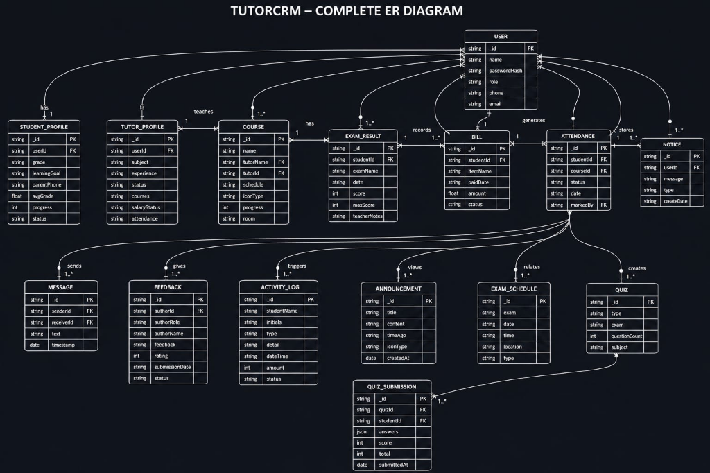

<div align="center">

# 🎓 TutorCRM Portal

### 🚀 Smart Tuition Center Management Platform


<br/>

[](https://tutorcrm-sigma.vercel.app/)
[](https://github.com/thalladachakri0166/tutorcrm)
[](#-license)

<br/>


</div>

---

## ✨ What is TutorCRM?

**TutorCRM** is a full-stack tuition center management platform designed to simplify the daily operations of modern coaching and tuition centers.

Instead of managing students, tutors, attendance, courses, examinations, fees, announcements, and performance records across multiple systems, TutorCRM brings everything together into **one centralized platform**.

> 🎯 **One Platform. Multiple Roles. Complete Tuition Management.**

---

## 🖥️ Live Application

<div align="center">

### 🌐 Try TutorCRM

<a href="https://tutorcrm-sigma.vercel.app/">

</a>

<br/><br/>

<a href="https://github.com/thalladachakri0166/tutorcrm">

</a>

</div>

---

# 🚀 Key Features

<table>
<tr>
<td width="50%">

### 🔐 Role-Based Authentication

Secure authentication system with dedicated access for:

* 👑 Master Admin
* 🛠️ Admin
* 👨‍🏫 Tutor
* 🎓 Student
* 👨‍👩‍👧 Parent

</td>

<td width="50%">

### 👨‍🎓 Student Management

Manage the complete student lifecycle:

* Add & update students
* Tutor assignment
* Enrollment tracking
* Student profiles
* Academic information

</td>
</tr>

<tr>
<td>

### 👨‍🏫 Tutor Management

Powerful tutor administration:

* Add / edit / delete tutors
* Course assignment
* Tutor profiles
* Student allocation
* Performance tracking

</td>

<td>

### 💳 Fee Management

Keep tuition finances organized:

* Payment tracking
* Paid / pending status
* Fee records
* Payment updates
* Parent payment visibility

</td>
</tr>

<tr>
<td>

### 📚 Course Management

Centralized course administration:

* Create courses
* Update course details
* Assign tutors
* Student enrollment
* Course access

</td>

<td>

### 📊 Performance Tracking

Monitor academic progress:

* Attendance
* Quiz scores
* Examination results
* Weekly performance
* Student feedback

</td>
</tr>

<tr>
<td>

### 📝 Exams & Quizzes

Interactive academic management:

* Create examinations
* Conduct quizzes
* Track scores
* Review performance
* Student results

</td>

<td>

### 📢 Announcements

Keep everyone connected:

* Admin announcements
* Tutor updates
* Student notifications
* Parent visibility
* Centralized communication

</td>
</tr>
</table>

---

# 👥 User Roles

```text
                         ┌─────────────────────┐
                         │    👑 MASTER ADMIN   │
                         │   Complete Control   │
                         └──────────┬──────────┘
                                    │
                         ┌──────────▼──────────┐
                         │      🛠️ ADMIN       │
                         │ Management & Reports │
                         └──────────┬──────────┘
                                    │
              ┌─────────────────────┼─────────────────────┐
              │                     │                     │
       ┌──────▼──────┐      ┌──────▼──────┐      ┌──────▼──────┐
       │ 👨‍🏫 TUTOR   │      │ 🎓 STUDENT  │      │ 👨‍👩‍👧 PARENT │
       │   Teaching   │      │   Learning  │      │   Tracking  │
       └─────────────┘      └─────────────┘      └─────────────┘
```

---

# 👑 Master Admin Dashboard

The Master Admin has complete platform-level control.

### Capabilities

* 👥 User management
* 📊 Platform analytics
* 📈 Reports
* 🛠️ System monitoring
* 🔐 Access management
* 📚 Monitor all modules

---

# 🛠️ Admin Dashboard

The Admin manages the core operations of the tuition center.

### 👨‍🎓 Student Management

* Add students
* Edit student records
* Assign tutors
* Track enrollment
* View student details

### 👨‍🏫 Tutor Management

* Add tutors
* Edit tutor information
* Delete tutors
* Assign courses
* View tutor details

### 📚 Course Management

* Create courses
* Update courses
* Assign tutors
* Manage enrollments

### 💳 Fee Management

* Track payments
* Paid / pending status
* Update payment records
* Monitor fee collection

### 📊 Reports

* Student reports
* Tutor reports
* Attendance reports
* Performance analytics
* Fee reports

---

# 👨‍🏫 Tutor Dashboard

Tutors get a dedicated workspace for teaching and student management.

| Feature          | Description                 |
| ---------------- | --------------------------- |
| 📅 Attendance    | Mark and monitor attendance |
| 📚 Courses       | Access assigned courses     |
| 📝 Exams         | Create/manage exams         |
| ❓ Quizzes        | Conduct quizzes             |
| 📊 Performance   | Review student scores       |
| 📢 Announcements | Share updates               |
| 👤 Profile       | Manage tutor profile        |

---

# 🎓 Student Dashboard

Students get a personalized learning environment.

* 📚 Enroll in courses
* 👨‍🏫 View tutor information
* 📝 Attempt quizzes & exams
* 📊 Track performance
* 💬 Submit feedback
* 📢 View announcements
* 📅 Monitor attendance

---

# 👨‍👩‍👧 Parent Dashboard

Parents can monitor their child's complete academic journey.

* 👦 View child information
* 📚 View enrolled courses
* 👨‍🏫 View assigned tutor
* 💳 Check payment status
* 💰 Access fee payment options
* 📈 Track academic progress
* 📅 Monitor attendance

---

# 🧩 Core Modules

<div align="center">

| 🔧 Module                |         👥 Access        |
| :----------------------- | :----------------------: |
| 🔐 Authentication        |         All Users        |
| 👨‍🎓 Student Management |           Admin          |
| 👨‍🏫 Tutor Management   |           Admin          |
| 📚 Courses               |       Admin / Tutor      |
| 📝 Exams                 |      Tutor / Student     |
| ❓ Quizzes                |      Tutor / Student     |
| 💳 Payments              |      Admin / Parent      |
| 📢 Announcements         |         All Users        |
| 📊 Reports & Analytics   |           Admin          |
| 📅 Attendance            | Tutor / Student / Parent |

</div>

---

# 🛠️ Technology Stack

<div align="center">

### 🎨 Frontend


### ⚙️ Backend


### 🗄️ Database


### 🔧 Tools & Deployment


</div>

---

# 🏗️ Project Architecture

```text
TutorCRM/
│
├── 📁 Frontend/
│   ├── 📁 src/
│   ├── 📁 components/
│   ├── 📁 pages/
│   ├── 📁 services/
│   ├── 📁 hooks/
│   └── 📄 package.json
│
├── 📁 Backend/
│   ├── 📁 controllers/
│   ├── 📁 models/
│   ├── 📁 routes/
│   ├── 📁 middleware/
│   ├── 📁 services/
│   ├── 📄 server.js
│   └── 📄 package.json
│
├── 📁 assets/
│   └── 🖼️ er_diagram.png
│
├── 📄 package.json
└── 📄 README.md
```

---

# 🔄 Application Flow

```text
                 👤 User
                   │
                   ▼
          🔐 Authentication
                   │
                   ▼
           🎭 Role Detection
                   │
        ┌──────────┼──────────┐
        ▼          ▼          ▼
      Admin      Tutor      Student
        │          │          │
        └──────────┼──────────┘
                   │
                   ▼
              📡 REST API
                   │
                   ▼
            🛠️ Express.js
                   │
                   ▼
             🗄️ Database
                   │
                   ▼
             📊 Dashboard
```

---

## 🗃️ Database Design

TutorCRM uses a structured database architecture to manage relationships between users, students, tutors, courses, attendance, payments, examinations, quizzes, and other platform entities.

<div align="center">

### 📐 Entity Relationship Diagram



</div>

### 🔗 Main Relationships

| Entity | Relationship | Description |
|---|---|---|
| 👤 **User → Student Profile** | 1 : 0..1 | Extends user information for students |
| 👤 **User → Tutor Profile** | 1 : 0..1 | Extends user information for tutors |
| 👨‍🏫 **User → Course** | 1 : N | Tutor can teach multiple courses |
| 🎓 **User → Exam Result** | 1 : N | Student can have multiple exam results |
| 🎓 **User → Bill** | 1 : N | Student can have multiple fee records |
| 👨‍🏫 **User → Quiz** | 1 : N | Tutor can create multiple quizzes |
| 📝 **Quiz → Quiz Submission** | 1 : N | A quiz can have multiple student submissions |
| 🎓 **User → Attendance** | 1 : N | Student can have multiple attendance records |
| 💬 **User → Message** | 1 : N | Users can send and receive messages |
| ⭐ **User → Feedback** | 1 : N | Students/parents can submit feedback |
---

# 📂 Project Structure

The project is divided into two major applications:

### 🎨 Frontend

React + Vite application responsible for:

* User interface
* Dashboards
* Role-based views
* API integration
* Responsive design

### ⚙️ Backend

Node + Express server responsible for:

* REST APIs
* Authentication
* Authorization
* Database operations
* Business logic
* API security

---

# 🚀 Getting Started

## 1️⃣ Clone Repository

```bash
git clone https://github.com/thalladachakri0166/tutorcrm.git

cd tutorcrm
```

---

## 2️⃣ Install All Dependencies

From the root directory:

```bash
npm run install:all
```

---

## 3️⃣ Configure Environment Variables

Create:

```text
Backend/.env
```

Example:

```env
PORT=5000
DATABASE_URL=mongodb://localhost:27017/tutorcrm
JWT_SECRET=your_secure_jwt_secret
GEMINI_API_KEY=your_gemini_api_key
```

> ⚠️ Never commit your `.env` file or API keys to GitHub.

---

## 4️⃣ Start Development Servers

```bash
npm run dev
```

### Application URLs

```text
🎨 Frontend → http://localhost:3000
⚙️ Backend  → http://localhost:5000
```

---

# 🔀 Run Frontend & Backend Separately

### Frontend

```bash
cd Frontend
npm install
npm run dev
```

### Backend

```bash
cd Backend
npm install
npm run dev
```

---

# 🔐 Security

TutorCRM implements several security concepts including:

* 🔑 JWT-based authentication
* 🛡️ Role-based authorization
* 🔒 Environment variable configuration
* 🚫 Protected API routes
* 👥 Role-specific dashboards
* 🔐 Secure password handling

---

# 📱 Responsive Experience

TutorCRM is designed to provide a smooth experience across:

```text
💻 Desktop
🖥️ Laptop
📱 Mobile
📲 Tablet
```

---

# 🎯 Project Goals

TutorCRM was created with five major goals:

### 01 — Simplify

Replace scattered tuition-management processes with one platform.

### 02 — Automate

Reduce repetitive administrative work.

### 03 — Connect

Improve communication between admins, tutors, students and parents.

### 04 — Track

Monitor attendance, fees and academic performance.

### 05 — Empower

Give every role the right tools and information through personalized dashboards.

---

# 🌟 Why TutorCRM?

```text
Traditional Tuition Center
          │
          ├── 📄 Manual Student Records
          ├── 📊 Separate Excel Sheets
          ├── 💰 Manual Fee Tracking
          ├── 📅 Attendance Registers
          ├── 📢 WhatsApp Communication
          └── ❌ Limited Parent Visibility

                    ↓

                 TutorCRM

                    ↓

          ┌────────────────────┐
          │ 🎓 Students        │
          │ 👨‍🏫 Tutors         │
          │ 👨‍👩‍👧 Parents       │
          │ 🛠️ Administrators  │
          │ 💳 Payments        │
          │ 📊 Analytics       │
          │ 📚 Courses         │
          │ 📝 Exams           │
          └────────────────────┘
```

---

# 📈 Future Improvements

TutorCRM is designed to grow.

Planned improvements include:

* 🤖 AI-powered student insights
* 📱 Mobile application
* 🔔 Push notifications
* 📧 Email notifications
* 💳 Advanced payment gateway integration
* 📊 Advanced analytics
* 📄 Automated report generation
* 🧠 AI-based performance recommendations
* ☁️ Improved cloud infrastructure
* 🔎 Advanced search & filtering

---

# 🤝 Contributing

Contributions, ideas and improvements are welcome!

```bash
# Fork the repository

# Create your feature branch
git checkout -b feature/AmazingFeature

# Commit your changes
git commit -m "Add AmazingFeature"

# Push to the branch
git push origin feature/AmazingFeature

# Open a Pull Request
```

---

# ⭐ Support the Project

If you found TutorCRM useful or interesting:

### ⭐ Star the repository

### 🍴 Fork the project

### 🐛 Report issues

### 💡 Suggest improvements

Every star and contribution helps the project grow! 🚀

---

# 👨‍💻 Developer

<div align="center">

## Thallada Chakri

### Frontend Developer | Full-Stack Developer

<a href="https://github.com/thalladachakri0166">

</a>

<a href="https://www.linkedin.com/in/thalladachakri">

</a>

<a href="https://thalladachakri.netlify.app/">

</a>

</div>

---

<div align="center">

### 💙 Built with passion, teamwork & innovation


### ⭐ If you like TutorCRM, don't forget to star the repository! ⭐

</div>
